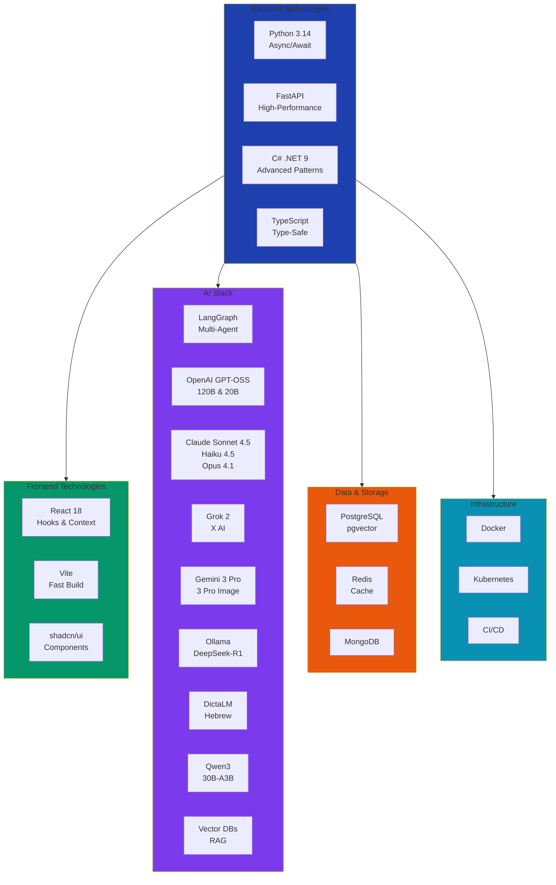
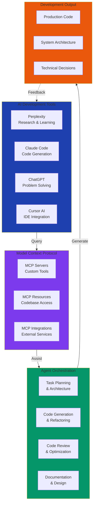
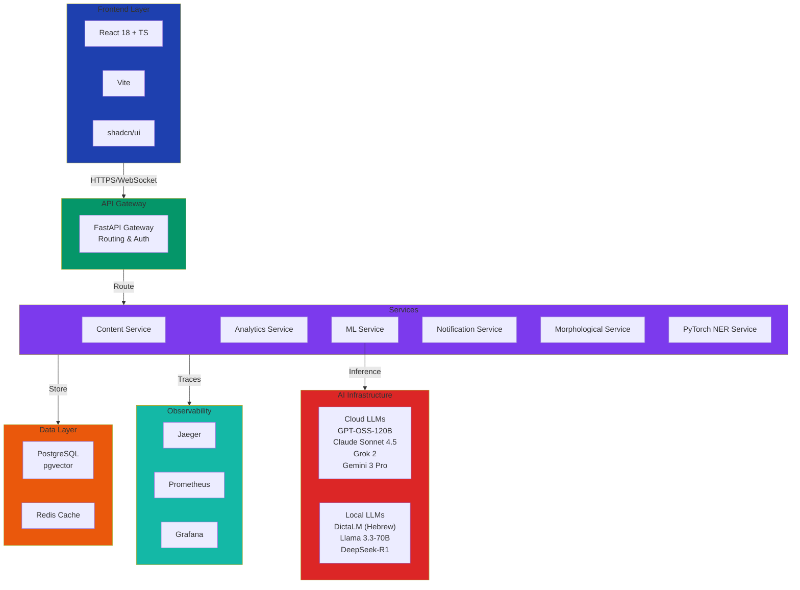
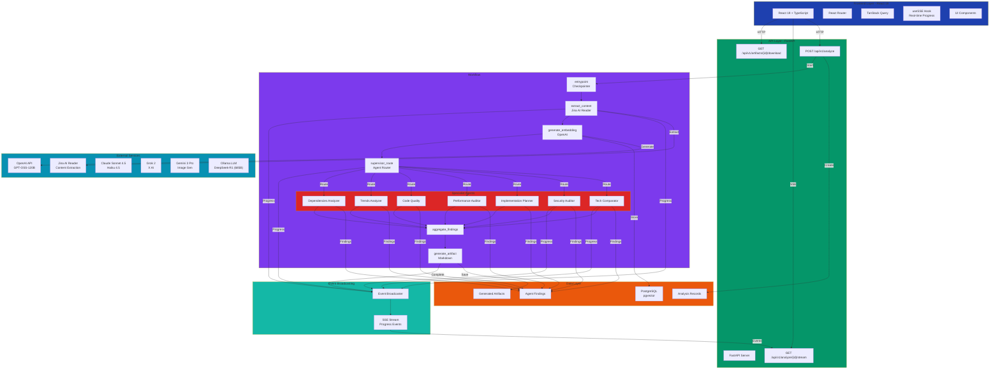

  
  
  
  <h3>
    Backend developer specializing in 
    microservices architecture, 
    distributed systems, and 
    AI integration
  </h3>
  
  

    
    
  

  
  

    
    
    
  

  

 

  
  <h2>
    
  </h2>
  
  

    <a href="#-about">About</a> • 
    <a href="#-tech-stack">Tech Stack</a> • 
    <a href="#-ai-development-workflow">AI Workflow</a> • 
    <a href="#-featured-projects">Projects</a> • 
    <a href="#-github-statistics">Stats</a> • 
    <a href="#-contact">Contact</a>
  

  

---

## 👤 About

Backend developer with expertise in building <strong style="color: #059669;">scalable, production-ready systems</strong>. 
Currently focused on <strong style="color: #7c3aed;">AI-powered applications</strong> using modern architectures including 
multi-agent systems, event-driven patterns, and async/await paradigms.

 

  
  <h4>🎯 Core Expertise</h4>
  
  <table>
    <tr>
      <td align="center" width="200">
        
      </td>
      <td align="center" width="200">
        
      </td>
      <td align="center" width="200">
        
      </td>
      <td align="center" width="200">
        
      </td>
    </tr>
    <tr>
      <td align="center" width="200">
        
      </td>
      <td align="center" width="200">
        
      </td>
      <td align="center" width="200">
        
      </td>
      <td align="center" width="200">
        
      </td>
    </tr>
  </table>
  

---

## 🛠️ Tech Stack

  
  <h3>🔄 Click to expand tech stack visualization</h3>
  

<b>🔧 View Complete Tech Stack</b>

---

## 🤖 AI Development Workflow

  
  <h3>🛠️ Agent-Based Development with MCP Integration</h3>
  
  

    <strong style="color: #7c3aed;">Agent-based development:</strong> All development tasks are orchestrated through AI agents, 
    leveraging <strong style="color: #059669;">MCP (Model Context Protocol)</strong> for seamless integration with codebases, 
    external services, and custom tools. This approach enables rapid iteration, intelligent code generation, 
    and comprehensive architecture design.
  

  
  <table>
    <tr>
      <td align="center">
        
      </td>
      <td align="center">
        
      </td>
      <td align="center">
        
      </td>
      <td align="center">
        
      </td>
      <td align="center">
        
      </td>
    </tr>
  </table>
  

<b>🔧 View Agent-Based Development Workflow</b>

**Workflow:** AI Tools → MCP Integration → Agent Orchestration → Development Output

---

## 🔥 Featured Projects

  
  <h2>🚀 Active Development Projects</h2>
  

### 🔒 reporter-accuracy

#### Full-Stack AI Development Platform | <em>November 2025</em>

**Tech Stack:** Python 3.14 (62%) + FastAPI | TypeScript (36%) + React 18 + Vite | shadcn/ui | Docker

  
  <table>
    <tr>
      <td align="center">
        
      </td>
      <td align="center">
        
      </td>
      <td align="center">
        
      </td>
      <td align="center">
        
      </td>
      <td align="center">
        
      </td>
      <td align="center">
        
      </td>
    </tr>
  </table>
  

**🎯 The Challenge**
• Manual content review is slow and error-prone
• Large document volumes overwhelm teams
• Quality standards vary across reviewers

**💡 The Solution**
AI-powered platform automates accuracy verification and quality assurance.

**✨ Key Features**
✅ Real-time content analysis and verification
✅ Multi-language support (Hebrew + English)
✅ Automated quality scoring system
✅ Semantic similarity clustering
✅ 7 microservices architecture
✅ Hybrid AI (Cloud + Local LLMs)

**📊 Impact**

<b>📐 View Architecture Diagram</b>

**Architecture:** Microservices (7 services) | API Gateway | Hybrid AI (Cloud + Local LLMs) | Observability Stack

---

### 🔒 trading-ai-analyst

#### AI-Powered Trading Analysis System | <em>November 2025</em>

**Tech Stack:** LangGraph 7-Agent System | Python 3.14 (52%) + FastAPI | TypeScript (46%) + Next.js 15 + React 19 | PostgreSQL + pgvector | Redis | LLM Pool (Local + Cloud)

  
  <table>
    <tr>
      <td align="center">
        
      </td>
      <td align="center">
        
      </td>
      <td align="center">
        
      </td>
      <td align="center">
        
      </td>
      <td align="center">
        
      </td>
      <td align="center">
        
      </td>
      <td align="center">
        
      </td>
    </tr>
  </table>
  

**🎯 The Challenge**
• Market analysis requires hours of manual work
• Multiple data sources are hard to synthesize
• Human error affects trading decisions

**💡 The Solution**
7-agent AI system analyzes markets and generates recommendations in real-time.

**✨ Key Features**
✅ LangGraph multi-agent orchestration
✅ Real-time market data processing
✅ Sentiment analysis from news and social media
✅ Technical and fundamental analysis
✅ Risk assessment and position sizing
✅ LLM pool with automatic failover
✅ Real-time WebSocket updates

**📊 Impact**

<b>📐 View Architecture Diagram</b>

```mermaid
graph TB
    subgraph Frontend["Frontend"]
        NextJS["Next.js 15 + React 19"]
        WebSocket["WebSocket Client"]
    end
    
    subgraph API["API Layer"]
        FastAPI["FastAPI Server<br/>Python 3.14"]
        Endpoints["REST + SSE Endpoints"]
    end
    
    subgraph Services["Services"]
        MarketService["Market Data"]
        SentimentService["Sentiment Analysis"]
        PortfolioService["Portfolio"]
        TradingService["Trading Signals"]
    end
    
    subgraph Agents["Agent System"]
        Supervisor["Supervisor Agent"]
        MarketAgent["Market Data Agent"]
        TechnicalAgent["Technical Agent"]
        FundamentalAgent["Fundamental Agent"]
        SentimentAgent["Sentiment Agent"]
        RiskAgent["Risk Agent"]
        DecisionAgent["Master Decision Agent"]
    end
    
    subgraph LLM["LLM Pool"]
        LocalLLM["Local DeepSeek<br/>DeepSeek-R1"]
        GPTOSS["OpenAI GPT-OSS<br/>120B & 20B"]
        Claude45["Claude Sonnet 4.5<br/>Haiku 4.5"]
        Grok["Grok 2<br/>X AI"]
        Gemini3["Gemini 3 Pro<br/>2.5 Pro"]
        Router["LLM Router<br/>Failover"]
    end
    
    subgraph Data["Data Layer"]
        PostgreSQL["PostgreSQL 16<br/>pgvector"]
        Redis["Redis Cache"]
    end
    
    subgraph Observability["Observability"]
        LangSmith["LangSmith"]
        Prometheus["Prometheus"]
    end
    
    Frontend --> API
    API --> Services
    API --> Agents
    Services --> Data
    Agents --> Services
    Agents --> LLM
    LLM --> Router
    Router --> LocalLLM
    Router --> GPTOSS
    Router --> Claude45
    Router --> Grok
    Router --> Gemini3
    Agents --> Data
    Agents --> Observability
    
    style Frontend fill:#1e40af
    style API fill:#059669
    style Services fill:#7c3aed
    style Agents fill:#dc2626
    style LLM fill:#0891b2
    style Data fill:#6366f1
    style Observability fill:#1C1C1E
```

**Architecture:** LangGraph 7-Agent Orchestration | Python 3.14 Free-Threaded | LLM Pool with Failover (Local → Cloud) | Real-time Market Data | WebSocket Streaming | Correlation Discovery | Anomaly Detection | LangSmith Observability

---

### 🔒 SkillForge

#### Research-to-Implementation Pipeline Platform | <em>November 2025</em>

**Tech Stack:** Python (FastAPI) + LangGraph v1.0 | TypeScript + React 19 | PostgreSQL + pgvector | Jina AI | SSE Streaming

  
  <table>
    <tr>
      <td align="center">
        
      </td>
      <td align="center">
        
      </td>
      <td align="center">
        
      </td>
      <td align="center">
        
      </td>
      <td align="center">
        
      </td>
      <td align="center">
        
      </td>
    </tr>
  </table>
  

**🎯 The Challenge**
• Research and planning take weeks before coding
• Technology comparisons are time-consuming
• Implementation plans lack detail

**💡 The Solution**
Automated pipeline transforms research into actionable implementation guides.

**✨ Key Features**
✅ Multi-agent analysis workflow
✅ Technology comparison engine
✅ Security and performance auditing
✅ Code quality assessment
✅ Real-time SSE progress streaming
✅ Automated artifact generation
✅ 7 specialist AI agents

**📊 Impact**

<b>📐 View Architecture Diagram</b>

**Architecture:** LangGraph v1.0 Multi-Agent System | SSE Real-time Progress | Content Extraction Pipeline | Research-to-Implementation Workflow

---

### 🔒 property-manager-ai

#### AI-Driven Property Management Platform | <em>October 2025</em>

**Tech Stack:** Python (57%) + FastAPI | TypeScript (43%) + React 19 | PostgreSQL + pgvector | LangGraph Multi-Agent | Redis | QStash | LangFuse

  
  <table>
    <tr>
      <td align="center">
        
      </td>
      <td align="center">
        
      </td>
      <td align="center">
        
      </td>
      <td align="center">
        
      </td>
      <td align="center">
        
      </td>
      <td align="center">
        
      </td>
      <td align="center">
        
      </td>
    </tr>
  </table>
  

**🎯 The Challenge**
• Hundreds of documents in multiple languages
• Finding information takes too long
• Tenant questions require manual document review

**💡 The Solution**
AI-powered platform extracts, translates, and answers questions from property documents.

**✨ Key Features**
✅ Multi-language document processing
✅ On-demand translation service
✅ Natural language Q&A with RAG
✅ Semantic and full-text search
✅ Multi-agent specialist system
✅ Automated entity extraction
✅ Real-time chat interface

**📊 Impact**

<b>📐 View Architecture Diagram</b>

```mermaid
graph TB
    subgraph Frontend["Frontend - React 19 + Vite"]
        React["React 19 + TypeScript"]
        Router["React Router"]
        Query["TanStack Query"]
        UI["shadcn/ui Components"]
        Flow["React Flow<br/>Graph Visualization"]
    end
    
    subgraph API["API Layer - FastAPI"]
        FastAPI["FastAPI Server"]
        DocumentsAPI["/api/v1/documents"]
        ChatAPI["/api/v1/chat"]
        SearchAPI["/api/v1/search"]
        PropertyAPI["/api/v1/property"]
        FinancialAPI["/api/v1/financial"]
        MaintenanceAPI["/api/v1/maintenance"]
    end
    
    subgraph Services["Service Layer"]
        DocumentService["Document Service<br/>Upload & Processing"]
        TranslationService["Translation Service<br/>On-Demand"]
        EmbeddingService["Embedding Service<br/>OpenAI"]
        SearchService["Search Service<br/>Semantic + Full-Text"]
        ChatService["Chat Service<br/>RAG"]
    end
    
    subgraph Agents["Multi-Agent System"]
        Supervisor["Supervisor Agent<br/>Claude 4 Opus<br/>Routing"]
        
        subgraph SpecialistAgents["Specialist Agents"]
            DocumentAgent["Document Agent<br/>Claude 3.7 Sonnet<br/>General Q&A"]
            FinancialAgent["Financial Agent<br/>Claude 3.7 Sonnet<br/>Transactions & Budgets"]
            MaintenanceAgent["Maintenance Agent<br/>Claude 3.7 Sonnet<br/>Work Orders"]
            PropertyAgent["Property Agent<br/>Claude 3.7 Sonnet<br/>Leases & Contacts"]
        end
        
        Checkpointer["PostgresSaver<br/>State Persistence"]
    end
    
    subgraph Data["Data Layer"]
        PostgreSQL["PostgreSQL 16<br/>pgvector Extension"]
        DocumentsTable["documents<br/>content + embeddings"]
        ConversationsTable["conversations<br/>Chat History"]
        CheckpointsTable["checkpoints<br/>LangGraph State"]
        Redis["Redis<br/>Cache + Rate Limiting"]
    end
    
    subgraph Background["Background Processing"]
        QStash["QStash<br/>Durable Jobs"]
        BackgroundTasks["Document Processing<br/>Embedding + Entities"]
    end
    
    subgraph Observability["Observability"]
        LangFuse["LangFuse<br/>AI Observability"]
        Traces["Agent Traces<br/>Cost Tracking"]
    end
    
    subgraph External["External Services"]
        Claude["Claude<br/>Sonnet 4.5<br/>Haiku 4.5"]
        OpenAI["OpenAI<br/>GPT-OSS-120B"]
        Grok["Grok 2<br/>X AI"]
        Gemini["Gemini 3 Pro<br/>Image Generation"]
        Supabase["Supabase<br/>PostgreSQL<br/>Storage"]
    end
    
    React -->|HTTPS| FastAPI
    FastAPI --> DocumentsAPI
    FastAPI --> ChatAPI
    FastAPI --> SearchAPI
    FastAPI --> PropertyAPI
    FastAPI --> FinancialAPI
    FastAPI --> MaintenanceAPI
    
    DocumentsAPI --> DocumentService
    ChatAPI --> ChatService
    SearchAPI --> SearchService
    
    DocumentService --> TranslationService
    DocumentService --> EmbeddingService
    DocumentService --> QStash
    QStash --> BackgroundTasks
    
    EmbeddingService --> OpenAI
    EmbeddingService --> PostgreSQL
    BackgroundTasks --> DocumentsTable
    
    ChatService --> Supervisor
    Supervisor -->|Route| DocumentAgent
    Supervisor -->|Route| FinancialAgent
    Supervisor -->|Route| MaintenanceAgent
    Supervisor -->|Route| PropertyAgent
    
    DocumentAgent -->|RAG| SearchService
    DocumentAgent -->|Query| DocumentsTable
    FinancialAgent -->|Query| PostgreSQL
    MaintenanceAgent -->|Query| PostgreSQL
    PropertyAgent -->|Query| PostgreSQL
    
    DocumentAgent --> Claude
    FinancialAgent --> Claude
    MaintenanceAgent --> Claude
    PropertyAgent --> Claude
    DocumentAgent --> Grok
    FinancialAgent --> Gemini
    
    Supervisor --> Checkpointer
    Checkpointer --> CheckpointsTable
    
    SearchService --> PostgreSQL
    SearchService --> Redis
    
    DocumentService --> LangFuse
    Supervisor --> LangFuse
    DocumentAgent --> LangFuse
    FinancialAgent --> LangFuse
    MaintenanceAgent --> LangFuse
    PropertyAgent --> LangFuse
    LangFuse --> Traces
    
    style Frontend fill:#1e40af
    style API fill:#059669
    style Services fill:#7c3aed
    style Agents fill:#dc2626
    style SpecialistAgents fill:#ea580c
    style Data fill:#6366f1
    style Background fill:#0891b2
    style Observability fill:#14b8a6
    style External fill:#1C1C1E
```

**Architecture:** Clean Architecture (DDD) | LangGraph Multi-Agent System | Hybrid Search (Semantic + Full-Text) | QStash Background Jobs | LangFuse Observability | Redis Caching

---

  
  
<em>🔒 Private projects - actively in development. Detailed architecture documentation available upon request.</em>

  

---

## 📊 GitHub Statistics

  
  
  
  

 

  
  
  

 

  
  
  

---

## 📫 Contact

  
  <h3>Let's Connect! 🚀</h3>
  
  
I'm always open to discussing technology, architecture challenges, innovative projects, or collaboration opportunities.

  
  

    
    
    
  

  

---

  
  
<em>"Code is like humor. When you have to explain it, it's bad." – Cory House</em>

  
  
  

