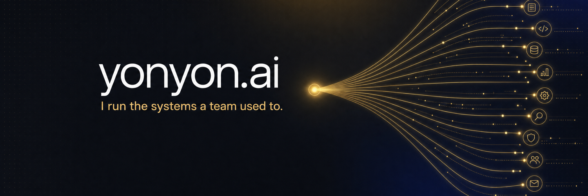

<div align="center">



<br/><br/>

### AI-native solo operator. I run the systems a team used to.

Agents, RAG, infrastructure, full-stack — the work that used to need a team, run solo.<br/>
Building **[yonyon.ai](https://yonyon.ai)** in public · creator of **[OrchestKit](https://github.com/yonatangross/orchestkit)**.

<a href="https://yonyon.ai"></a>
<a href="https://www.linkedin.com/in/yonatangross/"></a>
<a href="https://x.com/yonyoniz"></a>
<a href="mailto:yonatan2gross@gmail.com"></a>

</div>

---

I run a one-person AI software studio out of Tel Aviv. The pitch is simple: the systems a startup used to staff a team for — multi-agent backends, RAG, infra, CI, full-stack product — I design, ship, and operate solo, end to end. yonyon.ai is where I do it in public.

## OrchestKit — my flagship, the AI dev toolkit for Claude Code

<div align="center">

<a href="https://github.com/yonatangross/orchestkit"></a>
<a href="https://github.com/yonatangross/orchestkit"></a>


</div>

<br/>

> **Stop explaining your stack. Start shipping.** OrchestKit encodes production patterns — backend, frontend, AI/LLM, security, DevOps, testing, product — so Claude Code already knows your architecture before you type a word.

```bash
/plugin install ork
```

Coverage spans backend (FastAPI, PostgreSQL, REST/GraphQL), AI/LLM (LangGraph, RAG, evals, prompt engineering), frontend (React 19, Next.js, TypeScript), workflows (PR review, implementation, brainstorming), testing, DevOps (CI/CD, Docker, Terraform), product, and security.

<p align="center"><a href="https://github.com/yonatangross/orchestkit"><b>Repo</b></a> · <a href="https://orchestkit.vercel.app"><b>Docs</b></a></p>

---

## What I build

<table>
  <tr>
    <td width="50%" valign="top">
      <h3>Multi-agent AI platforms</h3>
      <p>Production LangGraph systems — supervisor/worker patterns, RAG over pgvector, real-time WebSocket streaming, and LLM pool failover across providers.</p>
      <p>
        
        
        
      </p>
    </td>
    <td width="50%" valign="top">
      <h3>AI operations infrastructure</h3>
      <p>End-to-end platforms with custom MCP servers, WhatsApp + comms integration, AI command centers, automated content pipelines, and LLM evaluation harnesses.</p>
      <p>
        
        
        
      </p>
    </td>
  </tr>
  <tr>
    <td width="50%" valign="top">
      <h3>Full-stack product</h3>
      <p>React 19 + Next.js front ends on FastAPI / Node back ends. Clean architecture, optimistic updates, TanStack Query, typed end to end with Zod.</p>
      <p>
        
        
        
      </p>
    </td>
    <td width="50%" valign="top">
      <h3>Infrastructure & DevOps</h3>
      <p>Terraform-managed infra across Hetzner, Cloudflare, and Vercel. Docker deploys, GitHub Actions CI/CD, and Cloudflare Tunnels for secure ingress.</p>
      <p>
        
        
        
      </p>
    </td>
  </tr>
</table>

---

## Stack

<div align="center">


<br/>


<br/>


</div>

---

<div align="center">

**Need a system that runs itself?** → **[yonyon.ai](https://yonyon.ai)**

</div>
