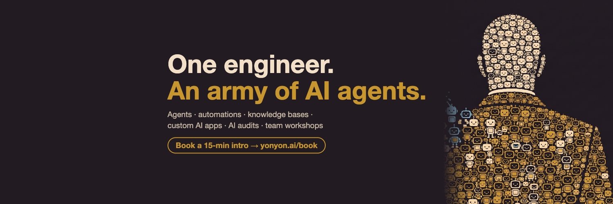

<div align="center">



<br/><br/>

### One engineer. An army of AI agents.

I build AI systems that run businesses: agents, automations, knowledge bases, custom AI apps.<br/>
Founder of **[yonyon.ai](https://yonyon.ai)** · creator of **[OrchestKit](https://github.com/yonatangross/orchestkit)**.

<a href="https://yonyon.ai"></a>
<a href="https://www.linkedin.com/in/yonatangross/"></a>
<a href="https://x.com/yonyoniz"></a>
<a href="mailto:hi@yonyon.ai"></a>
<a href="https://yonyon.ai/book?utm_source=github&utm_medium=profile"></a>

</div>

---

yonyon.ai is a one-engineer AI studio in Tel Aviv. I design, ship and run the whole system myself, with an army of AI agents doing the work around the clock: multi-agent backends, RAG, infrastructure, CI and full-stack product. Every change is reviewed before it ships.

## OrchestKit: the AI dev toolkit for Claude Code

<div align="center">

<a href="https://github.com/yonatangross/orchestkit"></a>
<a href="https://github.com/yonatangross/orchestkit"></a>


</div>

<br/>

> **Stop explaining your stack. Start shipping.** OrchestKit encodes production patterns (backend, frontend, AI/LLM, security, DevOps, testing, product), so Claude Code already knows your architecture before you type a word.

**Claude Code**

```bash
/plugin marketplace add yonatangross/orchestkit
/plugin install ork
```

**Cursor:** Settings → marketplaces → `yonatangross/orchestkit` → enable **ork** → new chat.

**Starter 12 (skills.sh, any agent)**, not the whole catalog:

```bash
npx skills add yonatangross/orchestkit -s doctor -s setup -s explore -s implement -s verify -s review-pr -s commit -s expect -s assess -s brainstorm -s create-pr -s remember
```

The implement skill is [`implement`](https://www.skills.sh/yonatangross/orchestkit/implement), not `ork-implement`.

Coverage spans backend (FastAPI, PostgreSQL, REST/GraphQL), AI/LLM (LangGraph, RAG, evals, prompt engineering), frontend (React 19, Next.js, TypeScript), workflows (PR review, implementation, brainstorming), testing, DevOps (CI/CD, Docker, Terraform), product, and security.

<p align="center"><a href="https://github.com/yonatangross/orchestkit"><b>Repo</b></a> · <a href="https://orchestkit.yonyon.ai"><b>Docs</b></a> · <a href="https://yonyon.ai/compare/orchestkit-superpowers"><b>vs Superpowers</b></a></p>

---

## What I build

<table>
  <tr>
    <td width="50%" valign="top">
      <h3>Multi-agent AI platforms</h3>
      <p>Production LangGraph systems: supervisor/worker patterns, RAG over pgvector, real-time WebSocket streaming, and LLM pool failover across providers.</p>
      <p>
        
        
        
      </p>
    </td>
    <td width="50%" valign="top">
      <h3>AI operations infrastructure</h3>
      <p>End-to-end platforms with custom MCP servers, WhatsApp + comms integration, AI command centers, automated content pipelines, and LLM evaluation harnesses.</p>
      <p>
        
        
        
      </p>
    </td>
  </tr>
  <tr>
    <td width="50%" valign="top">
      <h3>Full-stack product</h3>
      <p>React 19 + Next.js front ends on FastAPI / Node back ends. Clean architecture, optimistic updates, TanStack Query, typed end to end with Zod.</p>
      <p>
        
        
        
      </p>
    </td>
    <td width="50%" valign="top">
      <h3>Infrastructure & DevOps</h3>
      <p>Terraform-managed infra across Hetzner, Cloudflare, and Vercel. Docker deploys, GitHub Actions CI/CD, and Cloudflare Tunnels for secure ingress.</p>
      <p>
        
        
        
      </p>
    </td>
  </tr>
</table>

---

## Stack

<div align="center">


<br/>


<br/>


</div>

---

<div align="center">

**Want an army of AI agents working for your business?** → **[Book a 15-min intro](https://yonyon.ai/book?utm_source=github&utm_medium=profile)**

</div>
